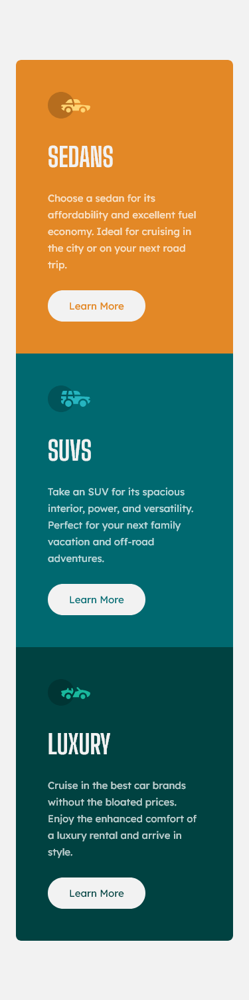
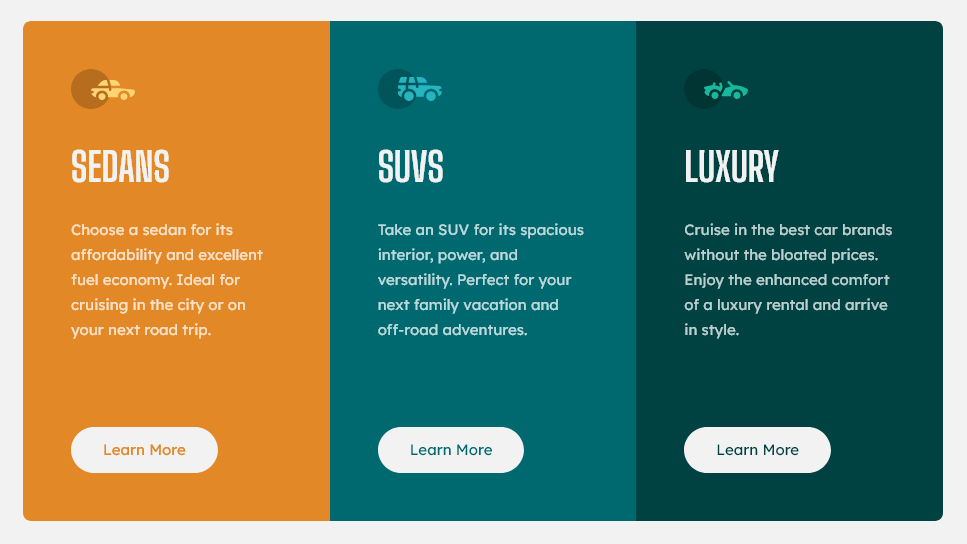
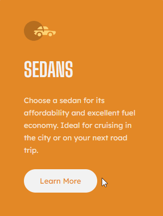

# Frontend Mentor - 3-column preview card component solution

This is a solution to the [3-column preview card component challenge on Frontend Mentor](https://www.frontendmentor.io/challenges/3column-preview-card-component-pH92eAR2-). Frontend Mentor challenges help you improve your coding skills by building realistic projects.

This project was completed using a **mobile-first workflow** with **semantic HTML markup**, **Grid** and **Flexbox**. It features a **responsive layout** and **links with ARIA labels**.

## Overview

### The challenge

Users should be able to:

- View the optimal layout depending on their device's screen size
- See hover states for interactive elements

### Links

- [Solution on Frontend Mentor]()
- [Live Site on GitHub Pages]()

### Screenshots

<table>
  <tr>
    <th align="center">Mobile</th>
    <th align="center">Desktop</th>
    <th align="center">Button States</th>
  </tr>
  <tr>
    <td>
      
    </td>
    <td>
      
    </td>
    <td>
      
    </td>
  </tr>
</table>

## My process

### What I learned

In this project, I have practiced the following skills:

- Using **Grid** and **media queries** to create a **responsive layout**
- Using **Flexbox** to arrange card content
- Creating **accessible links** with descriptive ARIA labels
- Styling button states with an **inner shadow** and **outline**
- Using **CSS relative units** to ensure the text scales according to the user's font size settings
- Using **CSS custom properties** to allow easy customization and reusability of components
- Using the **BEM naming convention** to create reusable components
- Applying the concept of **mixes** from the **BEM naming convention**
- Using **Git** and **GitHub**

#### Accessible links

Users who rely on screen readers to browse the web can choose to navigate the page from link to link. Because of that, link text should be descriptive and make sense without the surrounding context (unlike "learn more" or "click here" links).

Therefore, to meet [WCAG Success Criterion 2.4.9: Link Purpose (Link Only)](https://www.w3.org/WAI/WCAG21/quickref/#link-purpose-link-only), card links received **ARIA labels** that replace the original anchor text when read out by screen readers:

<!-- prettier-ignore -->
```html
<a href="#" class="button card__button" aria-label="Learn more about sedans">Learn More</a>
```

#### BEM mixes

The buttons in this project were styled in an independent `.button` class that could be used outside of the cards if more content were added. However, to follow the design, **the button text color must match de card's background color**. To implement this customization, a mix of the independent `.button` class and the block-specific `.card__button` class is used:

<!-- prettier-ignore -->
```html
<a href="#" class="button card__button" aria-label="Learn more about sedans">Learn More</a>
```

```css
.button {
  /* Independent class with "default" background and text colors */

  display: inline-block;

  padding-block: 0.75rem;
  padding-inline: 2rem;
  border-radius: 3.125rem;

  background-color: var(--color-very-light-gray);

  text-decoration: none;
  text-align: center;
  color: var(--color-dark-cyan);
}

/* ... */

.card__button {
  /* Block-specific class with text color set by card's custom property */
  color: var(--card-bg-color);
  margin-block-start: auto;
}
```

### Continued development

In future projects, I want to continue learning about **WCAG success criteria** to be more familiarized with the aspects that should be considered when creating web pages and applications that are accessible to everyone.

### Useful resources

- [_Mixes_ in _BEM For Beginners: Why You Need BEM_ — Inna Belaya (Smashing Magazine)](https://www.smashingmagazine.com/2018/06/bem-for-beginners/#mixes) - This is a great article written by an experienced technical writer who has been directly involved in the development of the technical documentation for BEM. The linked part of the article helped me understand the concept of mixes in BEM.
- [_ARIA8: Using aria-label for link purpose_ — W3C Web Accessibility Initiative](https://www.w3.org/WAI/WCAG22/Techniques/aria/ARIA8) - This guide contains examples on how to use ARIA labels to create accessible, descriptive links.

## Author

- Frontend Mentor - [@JulioCinquina](https://www.frontendmentor.io/profile/JulioCinquina)
